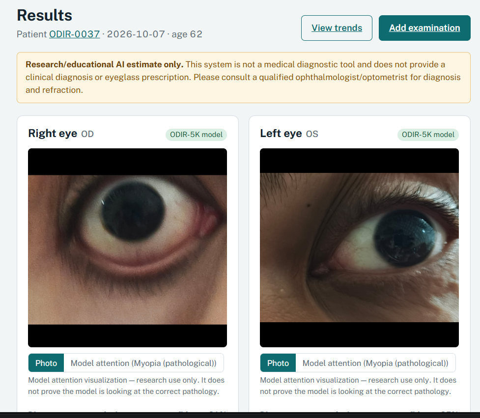
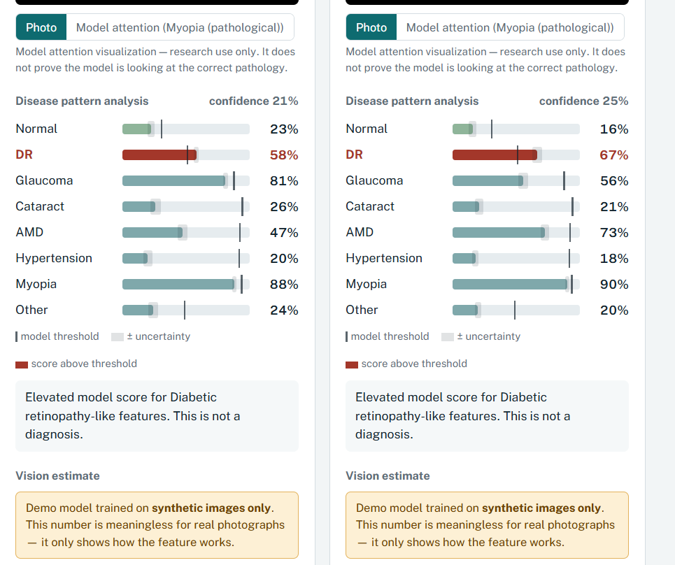

# EyeVision 

A research-oriented eye disease and vision-tracking project that combines retinal image analysis, patient-level disease prediction, and spherical equivalent (SE) estimation from fundus photographs.

> Research / educational prototype only. The system is not a medical device, does not provide a diagnosis, and must not be used for clinical decision-making. Please consult a qualified ophthalmologist or optometrist for actual patient care.

## Overview

EyeVision AI takes color fundus photographs and performs:

- multi-label disease classification for 8 eye conditions
- spherical-equivalent refractive error estimation
- patient examination history and trend tracking
- Grad-CAM-style model attention visualization
- a FastAPI web application with SQLite-backed patient data

The project is designed as an end-to-end research prototype and demo application for educational and experimentation purposes.

## Core objectives

1. Detect eye diseases from retinal fundus images.
2. Estimate refractive error (spherical equivalent, diopters) from image data.
3. Track changes across patient visits and eyes.
4. Provide explainability through Grad-CAM heatmaps.
5. Create a reproducible training/evaluation workflow for disease and refractive models.

## Disease classes

The disease model predicts the following 8 classes, matching the ODIR-style label space used in the codebase:

- Normal / healthy (N)
- Diabetic retinopathy (D)
- Glaucoma (G)
- Cataract (C)
- Age-related macular degeneration (A)
- Hypertensive retinopathy (H)
- Myopia (pathological) (M)
- Other abnormality (O)

The outputs are multi-label probabilities and are thresholded using validation-tuned per-class thresholds.

## Models used

### 1. Disease model

The disease task uses a deep convolutional neural network based on pretrained image backbones from timm:

- EfficientNet-B0 (default model)
- EfficientNet-B2
- ResNet-50
- ConvNeXt-Tiny

Architecture:

- backbone = timm pretrained CNN
- dropout layer
- linear output head with 8 logits
- sigmoid activation for multi-label binary classification

Model behavior:

- input: retinal fundus image
- output: probability for each disease class
- uncertainty estimated through Monte Carlo dropout passes
- confidence derived from prediction uncertainty

### 2. Refractive error model

The refractive model estimates spherical equivalent (SE) in diopters:

- backbone = pretrained CNN
- shared hidden layers
- regression head for spherical equivalent
- optional additional heads for sphere, cylinder, and axis estimation

Supported backbones include:

- ResNet-50 (default for refractive task)
- EfficientNet-B0
- EfficientNet-B2
- ConvNeXt-Tiny

This model is intended as an experimental estimate only and is not used as an actual prescription.

### 3. Demo / synthetic models

The repository ships synthetic demo models in the `models/demo/` folder. These are not medical-grade and are only for demonstration in the interface.

## Datasets used

### ODIR-5K

The main disease dataset is the Ocular Disease Recognition dataset (ODIR-5K), released as part of the ODIR-2019 challenge.

Key points:

- dataset source: ODIR-2019 challenge / Kaggle release
- label space: multi-label eye disease annotations
- challenge: public ophthalmic dataset with fundus image pairs
- data handling: patient-aware split logic prevents train/test leakage from both eyes of the same patient

Important design note:

- ODIR labels are patient-level in origin, but the project derives per-eye labels to avoid learning false relationships between the two eyes.
- The library enforces patient-level splits, meaning both eyes from the same patient remain in the same split.

### RFMiD

The project also supports external evaluation with RFMiD data for disease-related checks.

- source: RFMiD dataset from IEEE Dataport
- use: external validation/testing support
- pipeline support: `scripts/prepare_rfmid.py` and external evaluation mode in `evaluate.py`

### Synthetic refractive dataset

Because a sufficiently large public dataset with retinal images and measured refraction was not available in the packaged pipeline, the refractive model may be trained on:

- custom CSV files with refraction metadata
- synthetic demo/refraction data

Expected CSV schema:

```csv
image_path,patient_id,age,sex,sphere,cylinder,axis,spherical_equivalent
```

Optional fields include `eye` and image or patient metadata.

## Data pipeline

The project follows a structured pipeline for preprocessing, training, evaluation, and inference.

### 1. Preprocessing

The preprocessing pipeline handles:

- retina detection and crop
- black-border removal
- resizing and normalization
- image-quality heuristics
- caching for faster repeated runs

Relevant files:

- `preprocess.py`
- `dataset.py`
- `config.py`

### 2. Dataset preparation

The project includes helper scripts such as:

- `scripts/prepare_odir.py`
- `scripts/prepare_rfmid.py`
- `scripts/make_synthetic_data.py`

These scripts prepare image datasets and metadata into the project’s expected format.

### 3. Training

The training entrypoints are:

- `train.py`
- `evaluate.py`
- `predict.py`
- `baselines.py`

### 4. Model outputs

The project stores:

- trained checkpoints in `models/`
- sidecar metadata JSON files for metrics and config
- evaluation outputs in `reports/`
- SQLite patient examination data in `eyevision.db`

## File structure

```text
EyeVisionAI/
├── app/                     # FastAPI backend + frontend assets
│   ├── static/
│   ├── uploads/
│   ├── heatmaps/
│   ├── main.py
│   └── db.py
├── data/                    # dataset folders and caches
├── deploy/                  # deployment-related files
├── models/                  # trained model checkpoints and metadata
├── models/demo/             # synthetic demo models
├── notebooks/               # optional notebook workflows
├── reports/                 # plots, metrics, evaluation PDFs
├── sample_images/           # example images
├── scripts/                 # data prep and utility scripts
├── .gitignore               # ignore rules for Git
├── config.py                # central config and labels
├── dataset.py               # dataset loading and preparation
├── evaluate.py              # evaluation pipeline
├── gradcam.py               # Grad-CAM utilities
├── inference.py             # model inference engine
├── losses.py                # custom loss functions
├── metrics.py               # evaluation metrics
├── models.py                # model definitions and checkpoints
├── preprocess.py            # image preprocessing
├── predict.py               # single-image inference CLI
├── report_pdf.py            # report generation utilities
├── requirements.txt         # Python dependencies
├── run_app.py               # app launcher
├── train.py                 # training script
├── README.md                # project documentation
├── HOW_TO_RUN.txt           # quick run instructions
├── EyeVision_AI_Project_Report.pdf
├── Dockerfile               # Docker build for deployment
├── eyevision.db             # demo SQLite database
└── tests/                   # project test scripts
```

## Training and evaluation workflow

### Install dependencies

```bash
python -m venv .venv
.venv\Scripts\activate   # Windows
# or: source .venv/bin/activate  # macOS/Linux

pip install torch torchvision --index-url https://download.pytorch.org/whl/cpu
pip install -r requirements.txt
```

### Run the web app

```bash
python run_app.py
```

Then open:

```text
http://127.0.0.1:8000
```

### Disease training

```bash
python train.py --task disease --dataset odir --data-root <ODIR folder>
python train.py --task disease --dataset odir --arch resnet50
python train.py --task disease --dataset odir --arch efficientnet_b0 --loss focal --tag focal
```

### Refractive training

```bash
python train.py --task refractive --data-csv refraction.csv --arch resnet50
```

### Evaluation

```bash
python evaluate.py --task disease
python evaluate.py --task refractive
python evaluate.py --task disease --compare
```

### Prediction

```bash
python predict.py --image sample_images/odir_test_cataract.jpg
python predict.py --image sample_images/odir_test_cataract.jpg --gradcam cam.png
python predict.py --image <your image> --json
```

### Baselines

```bash
python baselines.py --task disease --dataset odir
python baselines.py --task refractive --data-csv data/refraction.csv
```

## Key design decisions

- Patient-level splitting is used to avoid leakage between eyes and patients.
- Disease and refractive tasks are treated separately.
- Multi-label disease classification uses per-class thresholds chosen on validation data.
- Model confidence is based on uncertainty estimates instead of raw accuracy.
- Grad-CAM is used for attention visualization, not confirmation of clinical correctness.
- Trends report observed changes in model output while clearly stating these may not reflect actual clinical change.

## Metrics and validation

The project includes metrics for:

- precision
- sensitivity / recall
- specificity
- F1-score
- ROC-AUC
- PR-AUC
- macro and micro metrics
- MAE, RMSE, and R² for regression
- error tolerance thresholds for refractive estimation

For disease classification, accuracy is not the headline metric; class imbalance and threshold tuning are a core part of the methodology.

## Web application

The built app includes:

- dashboard with recent patient visits
- patient detail pages
- trend visualization for spherical equivalent over time
- disease probability summaries
- model metadata and discovery
- upload-based single-image analysis
- heatmap / Grad-CAM visualization

The backend is FastAPI, and the UI is served through static HTML/CSS/JS with Chart.js-style trend views.

## Deployment

The project includes a Dockerfile for cloud deployment and optional hosting scenarios.

```bash
docker build -t eyevision-ai .
docker run -p 7860:7860 eyevision-ai
```

The app can also be deployed on Hugging Face Spaces or similar cloud hosts.

## Project report and evaluation

The repository includes a project report and evaluation artifacts:

- `EyeVision_AI_Project_Report.pdf`
- `reports/`
- model metadata JSON files
- comparative evaluation plots and tables

## Limitations and safety

This is a research prototype and not a clinical device.

Current limitations include:

- data from a single public dataset source
- label noise in annotations
- disease class imbalance
- no external clinical validation
- refractive model is synthetic/demo-based in the shipped version
- output should never be treated as a medical diagnosis or prescription

## Citations and references

- ODIR-5K dataset: Ocular Disease Recognition dataset, ODIR-2019 challenge
- RFMiD dataset: Pachade et al., Data 2021
- Grad-CAM: Selvaraju et al., ICCV 2017
- Focal loss: Lin et al., ICCV 2017
- Refractive error estimation reference: Yang et al., Frontiers in Medicine, 2022

## License and usage

Use this repository for research, learning, and educational experiments. Do not use it for patient care or clinical diagnostics without proper clinical validation and approval.

## Quick summary

This project combines:

- retinal image classification
- refractive error regression
- patient history tracking
- web visualization
- research-grade evaluation workflow

It is best understood as a demonstration of a complete eye-image AI workflow rather than a production medical system.


